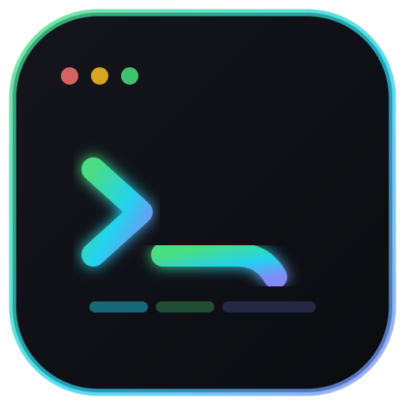
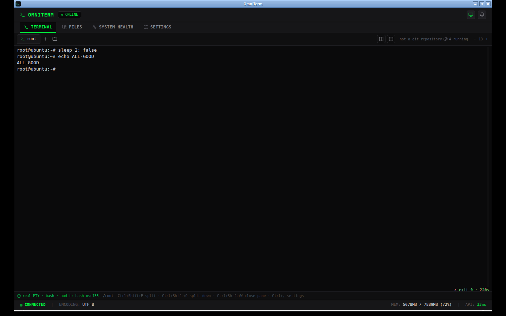
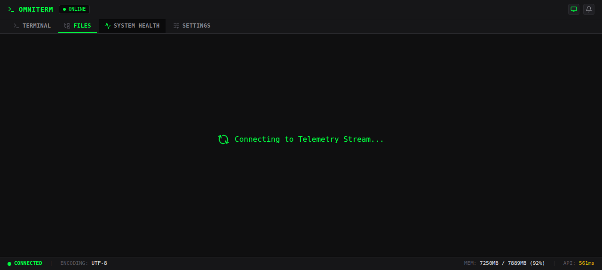
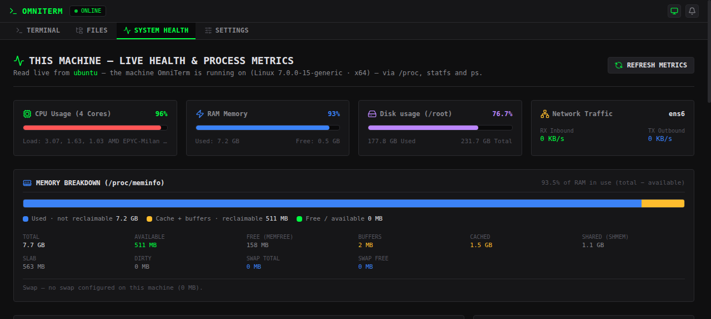
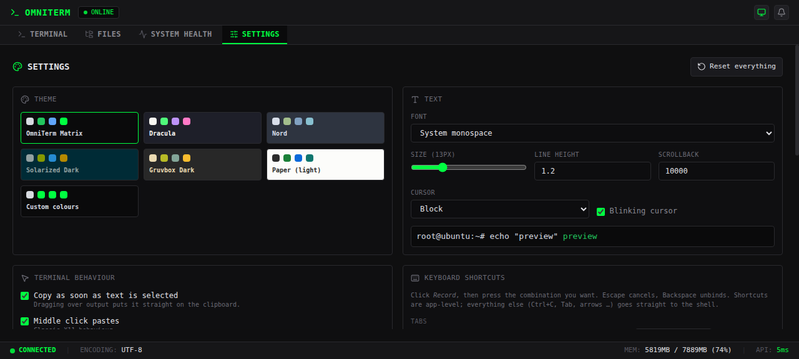

# OmniTerm

A real terminal emulator for Linux desktop — multi-tab sessions backed by your
**actual shell**, split panes, an AI assistant you point at any provider, live
host health monitoring, a backup snapshot engine and a file browser, packaged as
a native Ubuntu/Debian app.



## Features

- **Works with your shell, whatever it is** — bash, zsh and fish get full shell
  integration (their own prompt, their own aliases and functions, plus command
  and exit-code reporting to the audit trail). Each shell is hooked the way that
  shell requires: bash through a generated `--rcfile`, zsh through a generated
  `$ZDOTDIR`, fish through `--init-command`. Any other shell (dash, ash, sh)
  still runs as a normal interactive shell; only the exit code cannot be
  reported there, and the app says so instead of guessing.
- **A real terminal, not a command box** — every tab is an actual PTY running
  your login shell, so `vim`, `top`, `less`, `ssh`, job control, colours, Ctrl+C,
  Ctrl+D, Tab completion and your shell's own history all behave exactly as they
  do in GNOME Terminal or Konsole.
- **Your environment, adopted as-is** — `$SHELL`, `PATH` from `/etc/profile` and
  `~/.profile`, your aliases and functions from `~/.bashrc`, your prompt, your
  locale, your `~/.ssh` keys, and every package and tool you already installed.
  OmniTerm does not wrap, restrict or re-implement your shell.
- **Real shell execution for scripts and the `ai` command** — one-shot commands
  run through your `$SHELL` with real exit codes and real stderr.
- **Multi-tab sessions**, each with its own shell process, cwd and scrollback
  (10k lines) that survives tab switches.
- **Split panes** — split the terminal area vertically (side by side) or
  horizontally (stacked). Each pane is an independent PTY session, panes are
  closed individually, and the layout lives per tab.
- **Four tabs** — Terminal, Files, System Health and Settings. The previous
  **System & Security** and **AI Settings** tabs have been removed (the AI
  backend remains, see [Configuration](#configuration)).
- **A Settings tab for the whole app** — replaces the old per-tab clutter:
  built-in terminal colour schemes with a live preview, custom colours
  (background, foreground, cursor, selection, plus the UI accent), font family
  and font size, and an editor for every keyboard shortcut where each action's
  binding can be re-recorded and reset to defaults. Settings persist per machine
  (browser `localStorage`) and apply instantly.
- **Keyboard shortcuts** — every action is remappable in Settings; the defaults
  are in the [shortcut table](#keyboard) below.
- **Prefix history search** — type a prefix such as `git` and press Up/Down to
  cycle only the commands that start with it; with no prefix you get plain
  history. Sources are the commands run in the current session plus the shell's
  own history file (`~/.bash_history` for bash, `~/.zsh_history` for zsh,
  `~/.local/share/fish/fish_history` for fish). It can be turned off in
  Settings.
- **Mouse, the way a terminal should feel** — click to focus, drag to select,
  copy-on-select (toggleable in Settings), right-click for a context menu
  (copy / paste / clear / select all), middle-click to paste, and the wheel to
  scroll the scrollback. `Ctrl`/`Cmd`+click opens `http(s)` links in the system
  browser — only `http`, `https` and `file` are ever opened, validated before
  being handed to the OS. Full-screen apps (vim, htop, tmux) receive mouse events
  when they enable mouse reporting.
- **Command decorations and prompt navigation** — the OSC 133 markers the shell
  integration already installs are parsed into a per-command duration and
  exit-status decoration in the gutter, and jump-to-previous/next-prompt
  navigation skips long outputs.
- **Folder autocomplete** — Tab completes paths inside the terminal, and the
  new-tab folder picker completes directories as you type (`/api/complete`).
- **Real filesystem browser** — browse, read and edit actual files on disk
  (dirs, permissions, owners, symlinks, binary detection). Files are
  colour-coded by type — directory, executable, symlink, image, video, audio,
  archive, code by language, config, document, notebook, binary — each with a
  type badge, plus a legend and filter chips.
- **Live status bar** — the real `git` branch/dirty state of the shell's current
  directory and the actual Docker container count.
- **Command audit trail** — one-shot *and* interactive shell commands are
  appended to `~/.local/share/omniterm/activity.jsonl` (mode 0600) with exit
  code, cwd and timestamp, exportable as JSONL evidence. Inside the terminal the
  shell reports this via OSC 133/OSC 7 integration, which OmniTerm installs in
  `~/.local/share/omniterm/shell-integration.bash`.
- **Snapshots** — create real `tar.gz` archives of any directory (stored under
  `~/.local/share/omniterm/backups`) and get the exact restore command back.
- **AI assistant, any provider** — the backend still answers the `ai <prompt>`
  terminal command: a local model (Ollama, LM Studio, llama.cpp) that keeps
  everything on this machine, any OpenAI-compatible API (OpenAI, OpenRouter,
  Groq, DeepSeek, Mistral, Together, vLLM …) or Anthropic / Google Gemini.
  Nothing is hard-coded to one vendor and the key is write-only. It is
  configured through environment variables or
  `~/.local/share/omniterm/ai-config.json`; the **AI Settings** tab is gone from
  the UI.
- **Real host health** — RAM breakdown (used / cached+buffers / swap /
  available), the top processes by memory *and* an aggregation by program name
  (so 20 chrome processes are shown as one entry), swap usage, every real mount
  with its own usage, live disk I/O with the device name, per-core CPU usage,
  and CPU temperature when the hardware exposes it — plus load, network rates
  from `/proc/net/dev` and uptime. All read from `/proc`, `ps` and `statfs`.
- **Loopback-only API with a per-launch session token** — the local backend
  cannot be driven from a random web page.

## Keyboard

Every binding below is remappable in **Settings** (`Ctrl+,`), and each action can
be reset to its default.

| Shortcut | Action |
| --- | --- |
| `Ctrl+T` / `Ctrl+Shift+T` | new tab |
| `Ctrl+W` | close tab |
| `Ctrl+Tab` / `Ctrl+Shift+Tab` | next / previous tab |
| `Alt+1…9` | switch to tab N |
| `Ctrl+Shift+E` | split right |
| `Ctrl+Shift+O` | split down |
| `Ctrl+Shift+W` | close pane |
| `Ctrl+Shift+↑` / `Ctrl+Shift+↓` / `Ctrl+Shift+←` / `Ctrl+Shift+→` | move pane focus |
| `Ctrl+Shift+C` / `Ctrl+Shift+V` | copy / paste (middle-click pastes too) |
| `Ctrl+Shift+F` | search the scrollback |
| `Ctrl+Shift+K` | clear the screen |
| `Ctrl+Shift+PageUp` / `Ctrl+Shift+PageDown` | jump to previous / next prompt |
| `Ctrl+,` | open Settings |
| `Ctrl+=` / `Ctrl+-` / `Ctrl+0` | font size up / down / reset |
| `Shift+PageUp` / `Shift+PageDown` | scroll the scrollback |
| `↑` / `↓` | prefix history search (see above) |
| `Tab` | path and command completion (from your shell) |
| `Ctrl+C`, `Ctrl+D`, `Ctrl+L`, `Ctrl+R`, … | handled by your shell, as usual |

## What OmniTerm deliberately does *not* do

Fake features were removed rather than decorated: the previous "plugins" module,
"API & unit tests" runner and encryption toggles were UI mock-ups with no
backend. There is no fake cloud backup, no fantasy RBAC and no simulated
metrics — every number in the UI now comes from this machine.

## Screenshots








## Install on Ubuntu / Debian / Mint / Pop!_OS

### Option 1 — one command (recommended)

```bash
curl -fsSL https://raw.githubusercontent.com/zemmike/OmniTerm/main/install-linux.sh | bash
```

### Option 2 — Ubuntu Software / App Center

Download `OmniTerm-<version>-amd64.deb` from the
[releases page](https://github.com/zemmike/OmniTerm/releases) and **double-click
it** — Ubuntu Software opens and installs it, dependencies included.

### Option 3 — apt from the command line

```bash
VERSION=1.5.0
wget https://github.com/zemmike/OmniTerm/releases/latest/download/OmniTerm-$VERSION-amd64.deb
sudo apt install ./OmniTerm-$VERSION-amd64.deb   # apt resolves the dependencies
omniterm                                          # or launch it from the app grid
```

Uninstall with `sudo apt remove omniterm`.

### No-install options

- `OmniTerm-<version>-x86_64.AppImage` — `chmod +x` and run.
- `OmniTerm-<version>-x64.tar.gz` — unpack and run `./omniterm`.

(The suffixes come from electron-builder: `amd64` for Debian packages,
`x86_64`/`x64` for the portable builds.)

## Build from source

```bash
git clone https://github.com/zemmike/OmniTerm.git
cd OmniTerm
npm install
npm run build                 # frontend + backend bundle into dist/
npx electron-builder --linux deb    # → release/OmniTerm-1.5.0-amd64.deb
```

Requirements: Node.js 18+, and on Debian/Ubuntu the usual Electron runtime libs
(`libgtk-3-0 libnss3 libxss1 libxtst6 libatspi2.0-0 libsecret-1-0 xdg-utils`) —
the `.deb` declares them, apt pulls them in for you.

### Development

```bash
npm run dev      # Express + Vite dev server on http://localhost:3000
npm run lint     # tsc --noEmit
```

## Architecture

```
electron-main.cjs   Electron shell: picks a free loopback port, boots the
                    backend inside Electron's own Node runtime, hands the
                    renderer a session token, streams logs to
                    ~/.config/OmniTerm/omniterm.log
preload.cjs         Sandboxed bridge that exposes the token to the renderer
pty.ts              Real interactive terminals: one node-pty session per tab,
                    shell integration for bash/zsh/fish (OSC 133 + OSC 7),
                    spawned with the user's login shell + bash OSC 133/7
                    integration, exposed over a token-guarded WebSocket at
                    /term and turned into audit records
server.ts           Express API, all of it backed by the real machine:
                      /api/terminal/execute  real shell, real cwd, exit codes
                      /api/terminal/status   PTY availability + live sessions
                      /api/complete          path completion for app dialogs
                      /api/health            real host metrics
                      /api/env               platform, home, shell, AI provider
                      /api/files[/read|/save] real filesystem CRUD
                      /api/repo/status       real git state
                      /api/docker/status     real container state
                      /api/security          firewall, sshd, sockets, sudoers
                      /api/backups[/run]     real tar.gz snapshots
                      /api/activity-logs     audit trail (+ /api/audit/export)
                      /api/ai/settings       read the provider (key never returned)
                      /api/ai/test           real request, real latency or real error
                      /api/ai/models         models the provider offers
                      /api/ai/copilot        ask the configured provider
                      /api/ai/status         which provider is in use
src/                React 19 + Vite + Tailwind frontend (tabbed terminal UI)
src/settings.ts     persisted per-machine settings: theme, colours, font,
                    shortcut bindings (browser localStorage)
src/themes.ts       built-in terminal colour schemes
src/keys.ts         default keybindings and shortcut matching
src/components/SettingsView.tsx  the Settings tab UI
build/              Packaging resources (icon, .deb post-install hooks)
.github/workflows/  CI: build + install-check on every push, tagged releases
```

## Security model

OmniTerm executes shell commands, so the backend:

1. binds to `127.0.0.1` only,
2. requires the per-launch `x-omniterm-token` header on every `/api` request,
3. runs the renderer with `contextIsolation`, `sandbox` and no Node integration.

Never expose the backend port to a network.

## Configuration

Everything is optional — with nothing configured OmniTerm is a normal terminal.

### Appearance and shortcuts

Use the **Settings** tab (`Ctrl+,`): choose a built-in terminal colour scheme
with a live preview, set custom colours (background, foreground, cursor,
selection and the UI accent), pick a font family and size, and re-record or reset
any keyboard shortcut. Settings persist per machine in browser `localStorage` and
apply instantly.

### AI: any provider, not one vendor

The AI backend is still there for the `ai <prompt>` terminal command, but there
is no **AI Settings** tab in the UI — configure it through environment variables
or `~/.local/share/omniterm/ai-config.json` (mode `0600`). Supported backends:

- **Local, private** — Ollama (`http://127.0.0.1:11434` by default), LM Studio or
  llama.cpp's server. No API key, nothing leaves the machine.
- **OpenAI-compatible** — OpenAI, OpenRouter, Groq, DeepSeek, Mistral, Together,
  vLLM, or any other server exposing `/chat/completions`: set base URL, model and
  key, and it works.
- **Anthropic** (`/messages`) and **Google Gemini** (`generateContent`) — native
  request shapes.

The API key is write-only: it lives in `~/.local/share/omniterm/ai-config.json`
(mode `0600`) and is never returned to any interface. Choose the local provider
and nothing leaves this machine; choose a cloud provider and the prompt (plus any
terminal context you attach) is sent there.

The config file takes precedence, then environment variables, then auto-detected
local Ollama:

- `OMNITERM_AI_PROVIDER` — `openai`, `anthropic`, `gemini` or `ollama`.
- `OMNITERM_AI_BASE_URL` — endpoint, e.g. `https://api.deepseek.com/v1`.
- `OMNITERM_AI_MODEL` — model name.
- `OMNITERM_AI_API_KEY` — key. `OPENAI_API_KEY` and `ANTHROPIC_API_KEY` are also
  read, and `GEMINI_API_KEY` / `GOOGLE_API_KEY` act as a Gemini shortcut.
- `OMNITERM_AI_CONFIG` — config file location.
- `OLLAMA_URL`, `OMNITERM_OLLAMA_MODEL` — where the local daemon lives and which
  model to prefer.

Then use it from the terminal with `ai <question>`, or from the API at
`POST /api/ai/copilot`.

### Other

- `OMNITERM_EXEC_TIMEOUT_MS` — per-command timeout, defaults to 60000.
- `OMNITERM_BACKUP_DIR` — snapshot location, default
  `~/.local/share/omniterm/backups`.
- `OMNITERM_DATA_DIR` — audit trail and shell integration, default
  `~/.local/share/omniterm`.
- `OMNITERM_START_TAB` — tab to open at launch, e.g. `terminal` or `settings`
  (the tabs are `terminal`, `files`, `health` and `settings`).

## Shell support

| Shell | Config adopted | Prompt | Audit: command | Audit: exit code |
| --- | --- | --- | --- | --- |
| bash | `/etc/profile`, `~/.bash_profile`, `~/.profile`, `~/.bashrc` | yes | yes | yes |
| zsh | `$ZDOTDIR` (or `~`) `.zshenv/.zprofile/.zshrc/.zlogin` | yes | yes | yes |
| fish | `~/.config/fish/config.fish` | yes | yes | yes |
| dash, ash, sh, other | the shell's own defaults | yes | yes | no (unknown, reported as empty) |

`npm run test:pty-socket` checks one shell end to end; `bash
scripts/shell-matrix-test.sh` checks every installed shell (prompt, command
execution, a user alias from the shell's own config, Ctrl+C, and the audit
entries with their exit codes) against a throwaway `$HOME`.

## Roadmap

- Hash-chained audit entries (tamper-evident retention) and a signed apt repo.
- Per-tab tab titles.

## Security

Report vulnerabilities privately — see [SECURITY.md](SECURITY.md) for the policy,
the supported versions and the threat model, which spells out what counts as a bug
in a tool whose job is to run a shell as you. Dependabot opens weekly dependency
update pull requests.

Every release publishes a `SHA256SUMS` file covering all its assets, and
`install-linux.sh` verifies the `.deb` against it before installing anything.


## Licence

OmniTerm is released under the MIT Licence. See [LICENSE](LICENSE) for the
full text.

MIT © Michael (zemmike)
